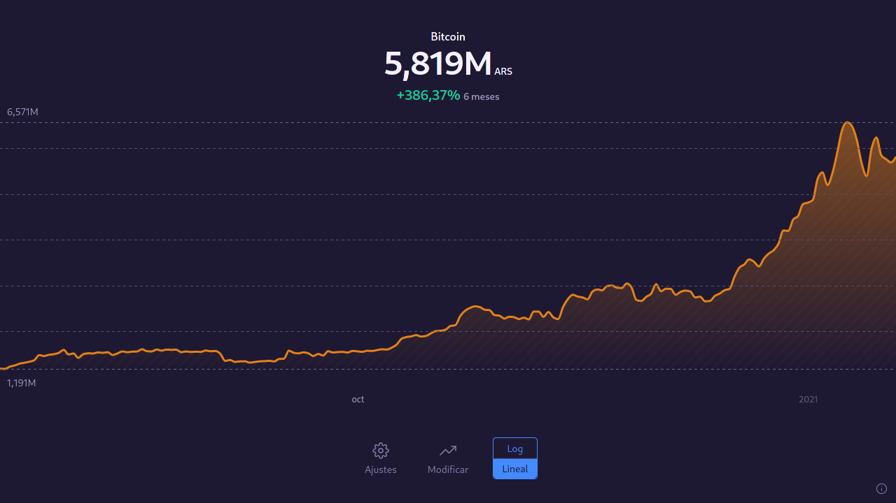

# Arsat <!-- omit in toc --> 

## Índice  <!-- omit in toc --> 
- [Acerca de](#acerca-de)
- [API](#api)
- [Fuentes](#fuentes)

## Acerca de
Este proyecto es, principalmente, un [PWA][pwa] que permite ver cotizaciones, algunas en tiempo real, entre las siguientes monedas:
- Peso argentino (ARS)
- [Dólar Estadounidense][blue] (USD)
- Bitcoin (BTC)
- Bitcoin (Satoshi) (SAT)

## API
- GET /api/prices/[base][cotizacion]

| Parámetro | Tipo           | Default           |
| --------- | -------------- | ----------------- |
| from      | [number][date] | [Date.now()][now] |
| to        | [number][date] | [Date.now()][now] |

Ejemplos:
- /api/prices/usdars devuelve el último precio del dólar en pesos

- /api/prices/btcusd?from=1609815660000&to=1610852460000 devuelve una lista de precios del bitcoin en dólares desde el 5 de enero de 2021 hasta el 17 de enero de 2021

## Fuentes
- Cotización histórica del dólar blue: [Ámbito][ambito]
- Estimación del precio actual del dólar blue: [Bluelytics][dolar]
- Cotización actual e histórica del bitcoin: [Coingecko][coingecko]

[pwa]: https://developer.mozilla.org/en-US/docs/Web/Progressive_web_apps
[ambito]: https://www.ambito.com/contenidos/dolar-informal-historico.html
[dolar]: https://bluelytics.com.ar
[blue]: https://es.wikipedia.org/wiki/Dolar_blue
[coingecko]: https://www.coingecko.com/en/api
[date]: https://developer.mozilla.org/en-US/docs/Web/JavaScript/Reference/Global_Objects/Date/getTime
[now]: https://developer.mozilla.org/en-US/docs/Web/JavaScript/Reference/Global_Objects/Date/now

---

Arsat es un proyecto Open Source, sin ningún fin más que el desarrollo del mismo.

No pretende brindar consejo, recomendación, ni asesoramiento de ningún tipo. Asimismo, todas las fuentes de información son de público acceso, por lo que no se será responsable de la falta de precisión, veracidad, y/o exactitud de los datos.